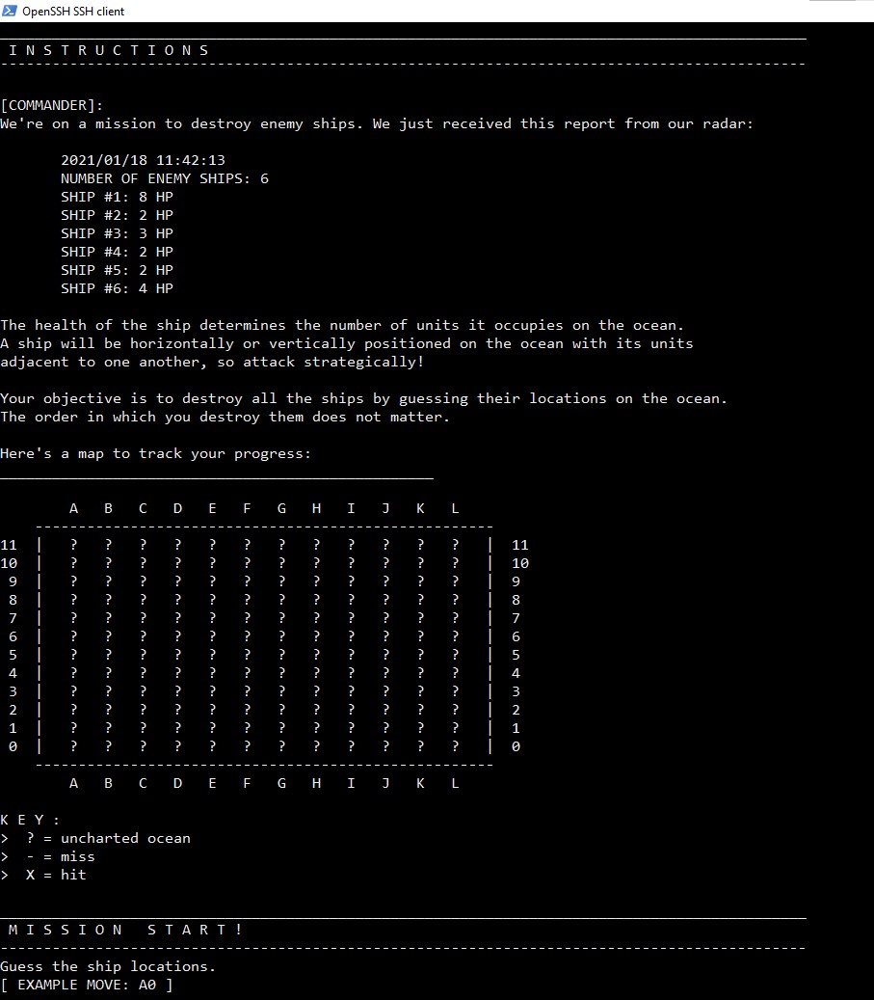

# Terminal Battleship
Battleship game that can be played in the terminal.

I first created Battleship V1 upon my first exposure to computer science. I decided to
revamp it (Battleship V2) after a few years to compare how my programming style has developed.

Note: The game prompt may appear buggy on Windows CML.

To run Battleship V2, first navigate to the directory and compile `Battleship.java`, `Ocean.java`, `Move.java`, and `ShipGenerator.java` as follows:
```
cd src
javac Battleship.java Ocean.java Move.java ShipGenerator.java
java Battleship
```


